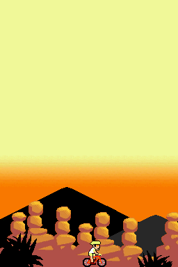

# Nintendo DS homebrews

I entered the programming world by making games for the Nintendo DS game console

## Geo DS (2009/02/07)

GeoDS is a DS homebrew application to allow better understanding of the regions in France.

ℹ️ [See More](./geo/README.md)
💾 [Download](./geo/geo.nds)

## BabyFoot DS (2007/04/14)

Baby foot is a table football game on DS.

ℹ️ [See More](./baby/README.md)
💾 [Download](./baby/baby.nds)

## VTT DS (2007/06/13)

VTT DS is a game of mountain biking.

ℹ️ [See More](./vtt/README.md)
💾 [Download](./vtt/vtt.nds)

