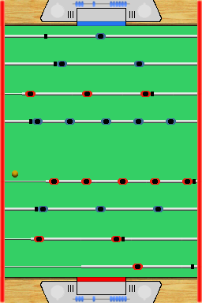

  <h1>BabyFoot DS</h1>
   
  

    
  

   

Baby foot is a table football game on DS.

## Download

- [💾 babyfoot.nds](./babyfoot.nds)
- [💾 babyfoot.nds.gba](./babyfoot.ds.gba) (GBA)
- [💾 babyfoot.sc.nds](./babyfoot.sc.nds) (SuperCard)

## User guide

The aim of the game is to move the ball into the opponent's goal by manipulating rods which have figures attached.

By doing a bottom up, you can strike the soccer ball.

## Controls

Left/Right - Move the defender and attacker bar to the left/right

Up/Down - Move the defender and attacker forward/backwards

Y/A - Move the running backs (middle bar) and goalkeeper to the left/right

X/B - Move the running backs (middle bar) and the goalkeeper forward/backwards

## Known issues

Missing Collisions between the ball and the players, and to AI.

## Changelog

[Changelog](./CHANGELOG.md)

## External links

🇫🇷 [Player Advance](http://www.playeradvance.org/forum/showthread.php?p=103846#post103846)
🇺🇸 [Gamebrew](https://www.gamebrew.org/wiki/Baby-foot_DS)
