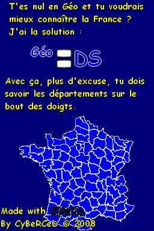
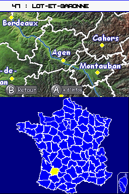
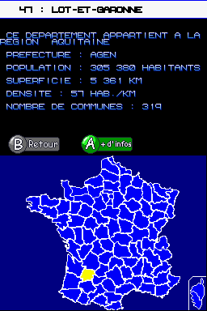
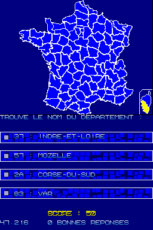

  <h1>Geo DS</h1>
   
  

    
  

   

GeoDS is a DS homebrew application to allow better understanding of the regions in France.

## Download

- [💾 geo.nds](./geo.nds)

## User Guide

Guess the name of the displayed region.

## Controls

### Learning mode

Stylus - Choose a region

R/L - Select the next/previous

A - More info

### Test mode

Stylus - Select correct answer in the MCQ

## Changelog

[Changelog](./CHANGELOG.md)

## Screenshots

## External links

🇫🇷 [Player Advance](http://www.playeradvance.org/forum/showthread.php?t=29390)
🇺🇸 [Gamebrew](https://www.gamebrew.org/wiki/G%C3%A9oDS)
